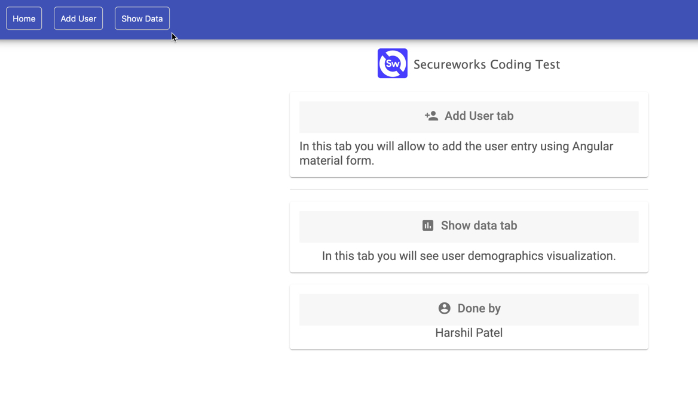

# Secure Works Coding Test

This application is built using Angular 7, Material design and D3

## Local Installation & Running Steps

### Clone the following repository
```bash
git clone https://github.com/Henry263/coding-test.git
```
### Installation (Run this command at the root of the project directory)
```bash
npm install
```

## Where to see running app?

```bash
http://localhost:4200/
```

## Information about the application?

### Home Page 
  - This page contains only information.





### Add User Tab
  - Users can enter the user data and store in browser storage.
  - Without browser, the storage data graph will load but it will refer the data from JSON file.
  - Once the browser will have some data users will have option to load the graph for both data storage.


### Show Data Tab
  - Users will able to see the graphical and tabular representation of the data.
  - You can toggle the data storage and respectively the graph will update.
  - If somehow browser data removed then option to render the browser data will be disabled.


## Created By
Harshil Patel (hrpatel.263@gmail.com)

